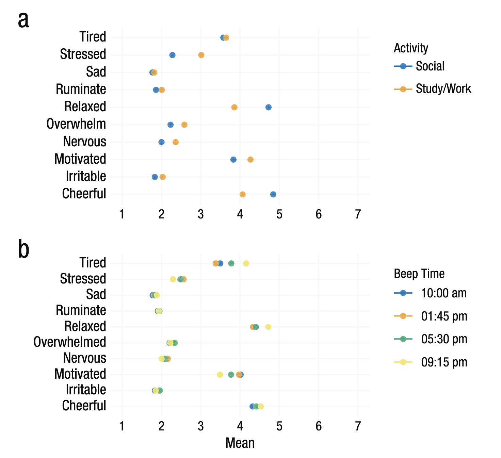

## Wozu Deskription?
Oft wird unter dem Begriff der *»deskriptiven Statistik«* eine Art *»einfache Statistik«* oder das Gegenteil zur Inferenzstatistik gesehen und entsprechend die Bestimmung von Lage- und Streuungsmaßen assoziiert.

Methodologisch gesehen sind Komplemente zur Deskription jedoch eher die Prädiktion, Explanation und Exploration, also das die Erkenntisziele Daten vorherzusagen oder zu imputieren (Prädiktion), kausale Aussagen zu falsifizieren/verifizieren (Explanation) oder (deskriptive/explanative) Hypothesen aufzustellen (Exploration). *»Deskriptionen«* wollen hingegen die Ausprägung von Variablen(-parametern) in Populationen bestimmen [@doering2016].

Bei der Unterscheidung von deskriptiver und Inferenz**statistik** meint »deskriptiv« meist, dass nicht über den Datensatz hinaus geschlussfolgert wird. Das ist m.E. jedoch sehr irreführend, denn die »Berechnung« eines arithmetischen Mittelwerts oder Medians kann eben auch die Punktschätzung eines Erwartungswertes einer normalverteilten Variable sein und damit in seiner Bedeutung sehr wohl über den Datensatz hinaus in die Population (besser: den datengenerierenden Mechanismus) hinein reichen.

Statt deskriptive von Inferenzstatistik zu unterscheiden, ist es hilfreicher **Punktschätzungen** (z.B. Mittelwert als Schätzer für Erwartungswert) von **Intervallschätzungen** zur Bestimmung der Schätzunsicherheit (Standardfehler, Konfidenzintervall) zu unterscheiden.
Weiterhin ist es hilfreich den Bereich der Inferenzstatistik einerseits in Testing- und Estimation-Ansätze zu unterscheiden, andererseits in frequentistische und bayesianische Ansätze [@kruschke2018].

|                    |  Frequentistische<br>Statistik | Bayesianische<br>Statistik |
|--------------------|:------------------------------:|:--------------------------:|
| Parameterschätzung | Konfidenzintervalle            | Posterior Distributions    |
| Hypothesentest     | p-Werte                        | Bayes Faktoren/ROPE +HDI.  |

> Inferenzstatistische *Schätzung* (estimation with quantified uncertainty) trifft anhand von Stichproben Aussagen über Parameter der Population (über den datengenerierenden Mechanismus).  <br><br>
(Inferenzstatistische) *Hypothesentests* bewerten anhand von Stichprobendaten die Gültigkeit von Hypothesen in der Population (bzgl. des datengenerierenden Mechanismus).

## Deskription der EMA-Daten aus Siepe et al. [-@siepe2025]
Im folgenden werden die Daten aus Siepe et al. [-@siepe2025] deskriptiv analysiert. Dabei wird recht direkt der Darstellung in diesem Tutorial gefolgt. In diesem Dokument wird jeweils der Code gezeigt, der dann in einer eigenen R-Installation ausgeführt werden kann. Wir interpretieren dann die Ergebnisse gemeinsam und übertragen sie auf Fragestellungen, die sich aus EMA-Daten der Teilnehmer:innen ergeben können.

### Datenimport
Die Originaldaten sind auf dem Open Science Framework verfügbar. Eine aufbereitete Version kann schon direkt aus dem Netz importiert werden.

```{r}
#| label: data_import
library(haven)
data_long <- read_sav(paste0(
  "https://raw.githubusercontent.com/",
  "sammerk/Modelling-EMA-Data/master/data/data_long_siepe.sav"
))
```

### Raincloud Plot
```{r}
#| label: raincloudplot
library(ggrain)
library(tidyverse)
# Zuerst wählen wir Items aus, die wir in einem Raincloud Plot darstellen wollen
selected_items <- c(
  "sad",
  "irritable",
  "sad",
  "ruminate",
  "tired",
  "motivated",
  "relaxed"
)


data_long %>%
  # Gruppieren nach Person und Item
  group_by(user_id, item) %>%
  # Berechnen des Mittelwerts pro Person und Item
  summarize(imean = mean(answer_id, na.rm = TRUE)) %>%
  # Groupierung aufheben
  ungroup() %>%
  # Items filtern
  filter(item %in% selected_items[1:5]) %>%
  # raincloud plot
  ggplot(aes(x = item, y = imean)) +
  geom_rain() +
  theme_minimal()
```

### Tabelle mit Standardstatistiken der ausgewählten Items
#### Between-Person-Statistiken
```{r}
#| label: standard_between_statistics
data_long %>%
  filter(item %in% selected_items) %>%
  group_by(item) %>%
  summarize(
    mean = mean(answer_id, na.rm = TRUE),
    med = median(answer_id, na.rm = TRUE),
    sd = sd(answer_id, na.rm = TRUE),
    skew = moments::skewness(answer_id, na.rm = TRUE),
    rmssd = psych::rmssd(answer_id, na.rm = TRUE)
  ) %>%
    arrange(item)
```

Während Mean und Median wahrscheinlich geläufige Statistiken sind, werden hier zur nochmals SD, Skewness und RMSSD erklärt:

* **Standardabweichung (SD)**:  $SD = \sqrt{\frac{1}{N-1} \sum_{i=1}^{N} (x_i - \bar{x})^2}$. Die SD beschreibt den durchschnittlichen »Abstand« der Datenpunkte zum Mittelwert und ist damit ein klassisches Streuungsmaß.
* **Schiefe (Skewness)**: $Skewness = \frac{1}{N} \sum_{i=1}^N\left(\frac{x_i-\bar{x}}{SD}\right)^3$. Die Schiefe nennt man auch das dritte Moment einer Verteilung, da die Differenz zwischen jedem Punkt und dem Mittelwert mit 3 potenziert wird. Dadurch beschreibt sie die Asymmetrie der Verteilung. Eine positive Schiefe bedeutet, dass die obere Hälfte der Datenpunkte stärker streut.
* **Root Mean Square of Successive Differences (RMSSD)**: $RMSSD = \sqrt{\frac{1}{N-1} \sum_{i=1}^{N-1} (x_{i+1} - x_i)^2}$. Die RMSSD beschreibt die durchschnittliche Differenz zwischen direkt aufeinanderfolgenden Datenpunkten und ist damit ein Maß für die (In-)Stabilität einer Zeitreihe und damit besonders interessant für EMA-Daten.

#### Within-Person-Statistiken
```{r}
#| label: standard_within_statistics
data_long %>%
  filter(item %in% selected_items) %>%
  group_by(user_id, item) %>%
  summarize(
    imean = mean(answer_id, na.rm = TRUE),
    imed = median(answer_id, na.rm = TRUE),
    isd = sd(answer_id, na.rm = TRUE),
    iskew = moments::skewness(answer_id, na.rm = TRUE),
    irmssd = psych::rmssd(answer_id, na.rm = TRUE)
  ) %>%
  ungroup() %>%
  group_by(item) %>%
  skimr::skim()
```

## Modalität
Sehr bedeutsam, aber schwierig in Standardstatistiken zu detektieren ist die Modalität von Verteilungen. Modalität beschreibt die Anzahl der Modi, also der Werte, die am häufigsten in einer Verteilung vorkommen. Eine unimodale Verteilung hat einen Modus, eine bimodale Verteilung hat zwei Modi und eine multimodale Verteilung hat mehr als zwei Modi. Modalität kann wichtige Informationen über die zugrunde liegenden Prozesse liefern, die die Daten generieren - etwa inwiefern Mischverteilungen vorliegen (z.B. aufgrund von State-Switching).
Die Modalität kann wieder zwischen und innerhalb von Personen sehr unterschiedlich ausgeprägt sein.
Außerdem ist sie durch statistische Prozeduren nur schwer zu detektieren. Als Goldstandard gilt die visuelle Inspektion von Dichteplots, diese ist für EMA-Daten aber oft nicht ökonomisch leistbar. Haslbeck et al. [-@haslbeck2023] haben daher einen Algorithmus entwickelt, der die Modalität von Verteilungen anhand von statistischen Kriterien bestimmt. Dieser Algorithmus ist in dem R-Package `{multimode}` [@ameijeiras-alonso2021] implementiert und kann auch für EMA-Daten angewendet werden.

## Decken- und Bodeneffekte
Zur Deskription von EMA-Daten wird oft auch die Beschreibung von Boden- und Deckeneffekten empfohlen. Damit ist jeweils eine vglw.hohe Dichte der Daten an den Enden von Skalen gemeint, die dann automatisch mit einer Schiefe der Verteilung einhergeht [@siepe2025].
Meist werden Boden- und Deckeneffekte als problematisch angesehen, da man annimmt, dass sie die Varianz von Daten reduzieren oder dass Schiefe zur Nicht-Angemessenheit von Verteilungsannahmen führt. Das kann insbesondere für psychometrische Items tatsächlich der Fall sein.
Sehr oft aber resultiert diese Ansicht aus einer Beschränkung der Modellierenden auf wenige Verteilungen (hauptsächlich ausschließlich Normalverteilung). Dann wird etwa der empirischen Verteilung des EMA-Items »*How many alcoholic beverages did you have last night*« ein Bodeneffekt attestiert, aufgrund des Wunsches, dass die Daten normalverteilt sein sollten. Tatsächlich wäre hier aber eine ordinal sequentielle ordinale Verteilung theoretisch wesentlich angemessener (und zeigt etwa bei Dora et al [-@dora2024] auch einen wesentlich besseren Fit).

## Kontextkovarianz
EMA-Studien wir die Möglichkeit zugesprochen »to captur[e] life as it is lived«  [@bolger2003]. Wenn dem so ist, sollten Kontexte Kovarianz mit entsprechenden Items zeigen. Ob dies in plausibler Art und Weise passiert, kann ebenfalls mit Plots sehr gut validiert werden.


Abbildung 4 in Siepe et al. [-@siepe2025] zeigt etwa Itemmittelwerte in Abhängigkeit von Arbeit-/Freizeit und Beep-Time.


## Zeitliche Fluktuation
Auch die zeitliche Fluktuation bzw. die Autokorrelatation ist in EMA-Daten eine entscheidende Itemcharakteristik und kann gut über Visualisierungen inspiziert werden. Etwa wie in Abbildung 5 in Siepe et al. [-@siepe2025].

![Abbildung 5 in Siepe et al. [-@siepe2025]](img/fig5-siepe.png)


## Baselinekovariation
Itemvarianz on EMA-Daten lässt sich wie gesehen auf Kontext- und Zeit- aber eben auch auf Personencharakteristika zurückführen. Zur Untersuchung dieser Itemperformanzen eignen sich u.a. Mosaicplots der Varianzdekomposition und Clustered Heatmaps der Baselinekorrelationen wie in Abbildung 9 & 10 in Siepe et al. [-@siepe2025] dargelegt.

![Abbildungen 9 & 10 in Siepe et al. [-@siepe2025]](img/fig910-siepe.png){.lightbox}
